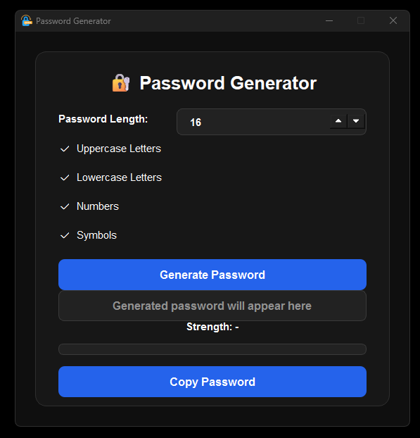

# 🔐 Password Generator

A modern desktop password generator application built with **Python** and **PyQt6**.

This application allows users to generate secure random passwords with customizable options such as uppercase letters, lowercase letters, numbers, and symbols.

## 📸 Screenshot



## 🚀 Features

- Generate secure random passwords
- Select password length between 8 and 64 characters
- Include uppercase letters
- Include lowercase letters
- Include numbers
- Include symbols
- Password strength indicator
- Copy generated password to clipboard
- Modern dark user interface
- Simple and beginner-friendly project structure
- Custom application icon

## 🛠 Technologies Used

- Python
- PyQt6

## 📁 Project Structure

```text
Password-Generator/
│
├── main.py
├── README.md
├── requirements.txt
├── .gitignore
│
├── assets/
│   └── icon.ico
│
├── core/
│   └── generator.py
│
├── screenshot/
│   └── 0001.png
│
└── ui/
    └── main_window.py
```

## ⚙️ Installation

Clone the repository:

```bash
git clone https://github.com/himmetsepik/Password-Generator.git
```

Go to the project folder:

```bash
cd Password-Generator
```

Install the required packages:

```bash
pip install -r requirements.txt
```

Run the application:

```bash
python main.py
```

## 📦 Requirements

```txt
PyQt6
```

## 🎯 How to Use

1. Select the password length.
2. Choose the character types:
   - Uppercase letters
   - Lowercase letters
   - Numbers
   - Symbols
3. Click the **Generate Password** button.
4. Check the password strength.
5. Click the **Copy Password** button to copy the generated password.
